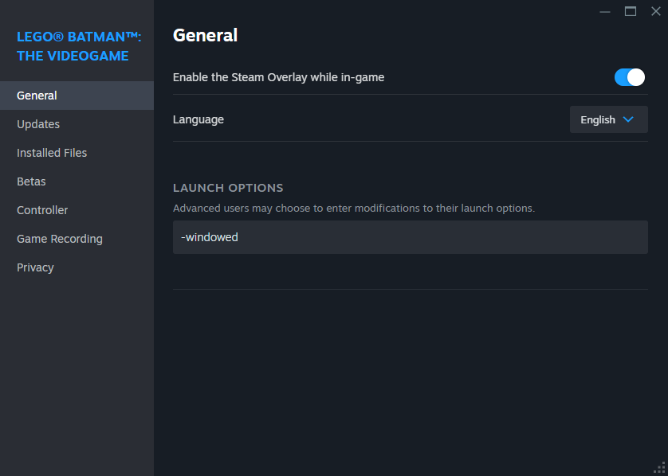
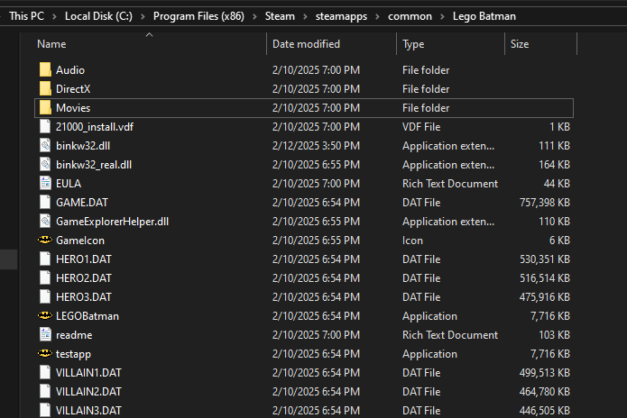
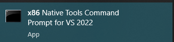

# lego-batman-borderless-fullscreen-hack
A mod ("hack") for Lego Batman that allows you to run the game in borderless fulscreen 

This can be used to fix a bug inwhich cutscenes will freeze for few muniets when they start. This bug seems to be caused by Lego Batman's exlusive fullscreen mode.

This mod works by tricking Lego Batman into loading in a fake `binkw32.dll`. This custom .dll creates a new thread that waits for the Lego Batman window to open, then makes the window the size of the current monitor and borderless (borderless fullscreen). It also passes through the original functions.

# How to setup and install
- Force the window to launch in windowed mode (properties > general > Launch Options, input "-windowed")



- Open Lego Batman directory (properties > installed files > browse)
- Rename the original `binkw32.dll` to `binkw32_real.dll`
- Copy this `binkw32.dll` to the Lego Batman directory



# building
You do not have to build this mod, a pre-compiled binary should be included in the latest release.

That being said, to build you need [MSVC (x86)](https://visualstudio.microsoft.com/downloads/#build-tools-for-visual-studio-2022) installed. 

Once you install MSVC (x86), run the Native Tools Command Line and run these instructions: 



```sh
cd <this directory>
build.bat 
```# lego-batman-borderless-fullscreen-hack
